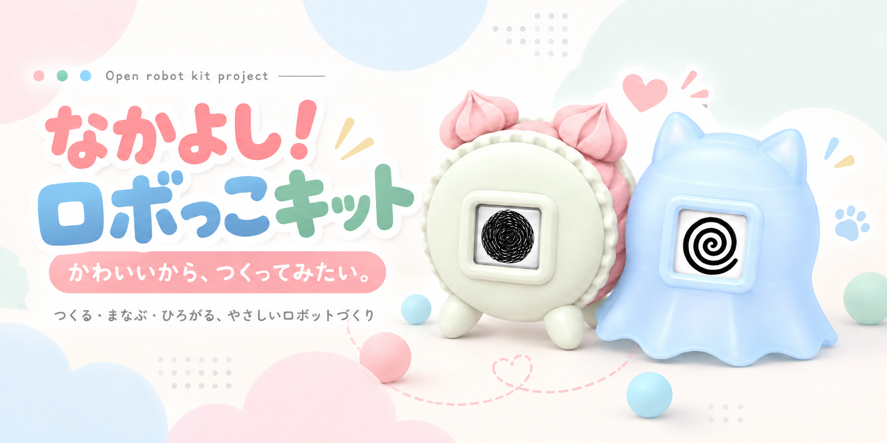
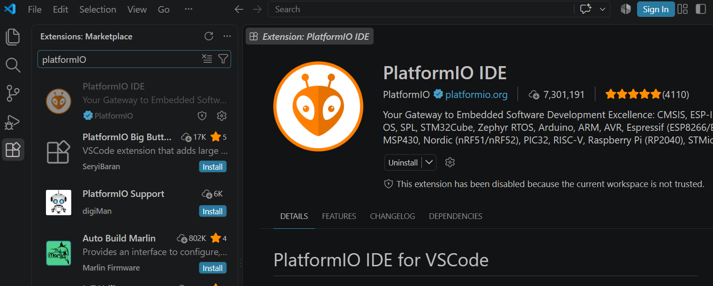
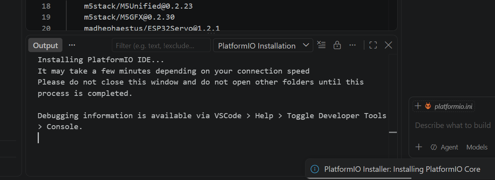
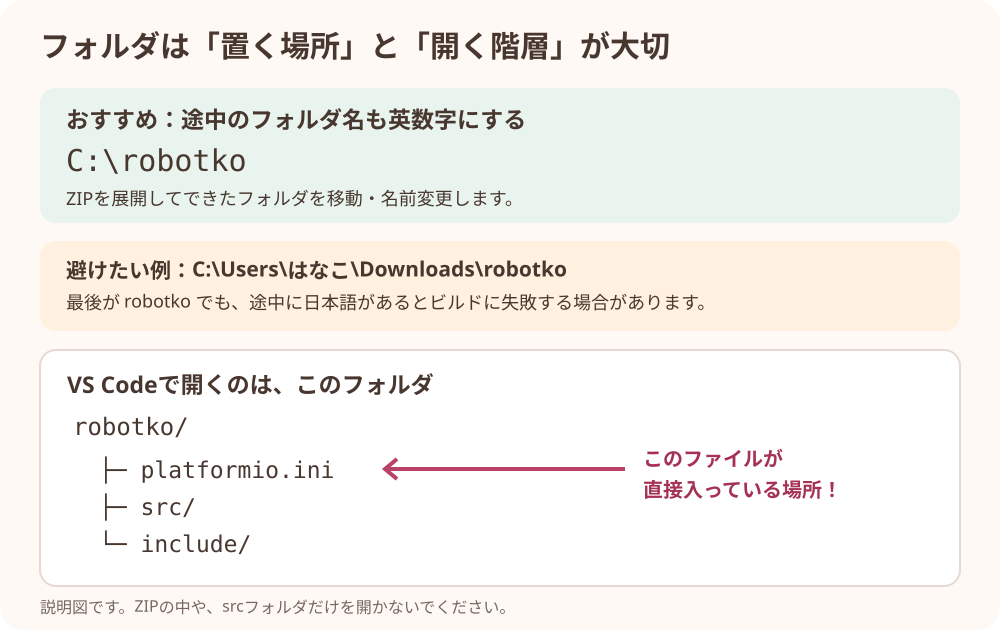
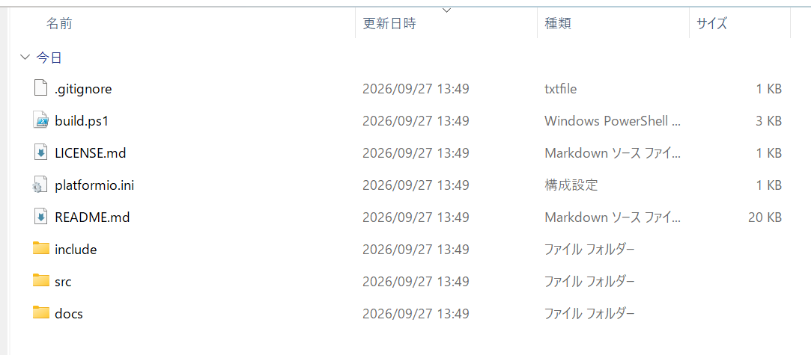
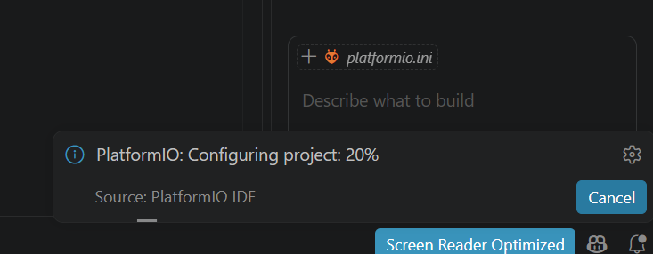
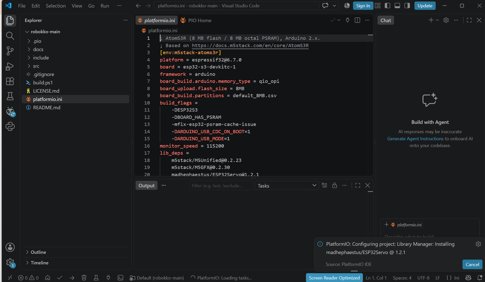
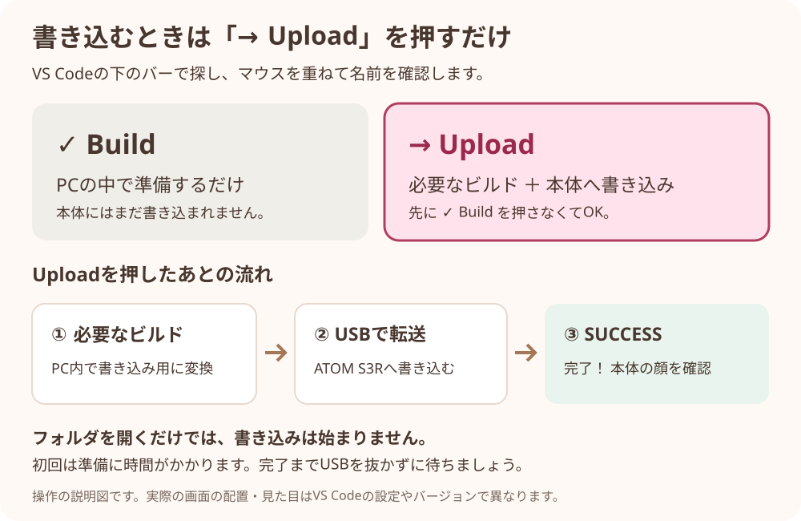
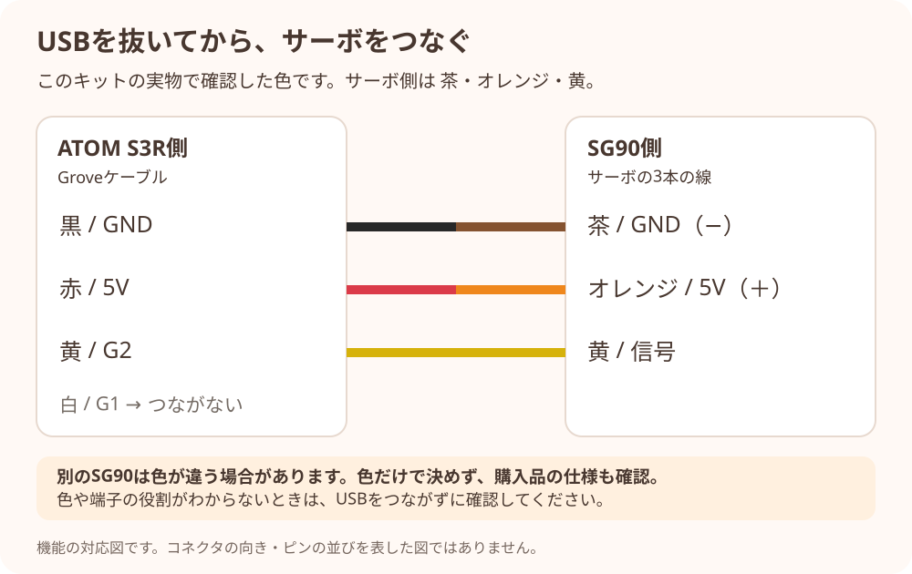
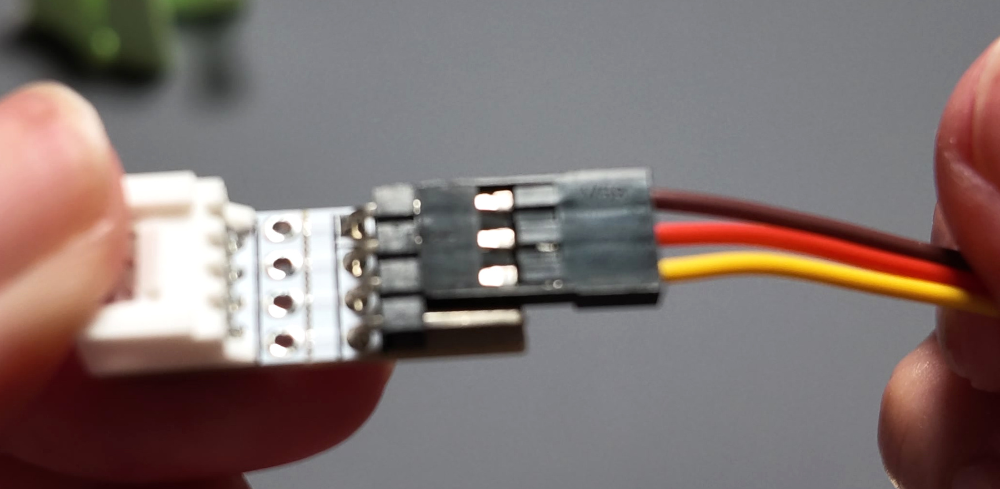

# なかよし！ロボっこキット — ATOM S3R



**かわいいから、つくってみたい。気づいたら、ちゃんとロボットをつくってた。**

M5Stack ATOM S3Rの小さな画面に顔を出して、SG90サーボモーターを動かすプログラムです。
ボタンを押すと動き、本体を横にすると寝顔になります。

ここでは **プログラム・書き込み手順・配線手順・写真つきの組み立て説明書・3D印刷データ** を公開しています。

## どこから始める？

| やりたいこと | 開くページ |
| --- | --- |
| マカロンちゃんを自分で印刷したい | [必要なデータと個数](docs/printing.md#macaron) |
| おばけねこを自分で印刷したい | [必要なデータと個数](docs/printing.md#obakeneko) |
| キットのパーツを持っていて、組み立てたい | [写真つき説明書（カラーPDF）](docs/assembly.md) |
| 電子部品・バッテリー・道具をそろえたい | [買い物リスト](docs/shopping-list.md) |
| ATOM S3Rにプログラムを書き込みたい | [この下の「はじめに」](#はじめに) |

自分で印刷する場合は、**部品をそろえる → 外装・機構を印刷 → ATOMへ書き込み → 組み立て → 動作確認** の順で進めます。
印刷済みパーツがある方は印刷の工程を飛ばして進められます。

**キットを組み立てる方は → [マカロンちゃん・おばけねこの作り方（カラーPDF）](docs/assembly.md)**

**これから部品をそろえる方は → [買い物リスト（通販・店頭の案内）](docs/shopping-list.md)**

## はじめに

この説明は **PlatformIO IDE拡張を入れたVS Code** を使う方向けです。
初めてでも、プログラムを書き換えずに、そのままロボっこを動かせます。
Windowsを中心に説明し、Macで操作が違うところは補足しています。実機での動作確認はWindowsで行っています。
AIコーディングツールなどに、このページのURLと困っていることを渡して相談することもできます。

進め方は **アプリの準備 → ダウンロード → 本体へ書き込み → 顔の確認 → 配線 → サーボの確認** です。
書き込み済みの本体をワークショップで受け取った方は、スタッフに確認して「6. 顔が出ることを確認する」から始めてください。

## 出てくる専門用語

- **VS Code**：プログラムのフォルダを開いて、操作するアプリ。無料で使えます。
- **PlatformIO（プラットフォーム・アイオー）**：VS Codeに追加する、マイコンへプログラムを書き込む道具。
- **ビルド（Build）**：プログラムを、ATOM S3Rが実行できる形に変換すること。
- **書き込み（Upload）**：変換したプログラムを、USBでATOM S3Rに送ること。

## 用意するもの

| 用意するもの | 確認すること |
| --- | --- |
| PC | インターネットにつながっているもの |
| VS Code ＋ PlatformIO IDE拡張 | 拡張の準備が完了していること |
| M5Stack ATOM S3R | 小さな画面が付いたモデル |
| USBケーブル | **データ通信できるもの**。本体側はUSB Type-C、PC側は自分のPCに合う形 |
| SG90サーボモーター | 最初の書き込みでは、まだ接続しない |
| Groveケーブル・Grove4ピン変換アダプタ | それぞれ1つ。[購入する商品はこちら](docs/shopping-list.md) |

<a id="app-setup"></a>

### アプリを準備する（初回だけ）

1. [VS Codeの公式サイト](https://code.visualstudio.com/)から、自分のPC用のアプリをダウンロードしてインストールします。
2. VS Codeを起動し、左端の **「拡張機能」**（四角が並んだアイコン）を押します。見つからない場合は、Windowsは `Ctrl + Shift + X`、Macは `⌘ + Shift + X` を押します。
3. 検索欄に **`PlatformIO IDE`** と入力します。
4. 提供元が **PlatformIO** のものを選び、**「インストール / Install」** を押します。
5. 準備が終わるまで待ちます。再起動を求められたらVS Codeを再起動します。

すでに拡張が入っている方は、この準備をやり直す必要はありません。
[PlatformIO公式の導入手順（画面例あり）](https://docs.platformio.org/en/stable/integration/ide/vscode.html#installation)



画像は導入済みの例なので「Uninstall」が表示されています。初めて入れるときは「Install」を押します。
未信頼フォルダのため無効と表示された場合は、[手順3](#3-vs-codeでフォルダを開く)で、このリポジトリから入手したフォルダであることを確認して信頼します。



この表示の間は準備中です。インターネットにつないだまま、完了するまで待ちます。

**この手順ではUSBから電気を受け取って動かします。バッテリーを付けていない場合、USBを抜くと画面も消えます。**
コードレスで持ち歩きたい方には、対応バッテリーの追加がおすすめです。[バッテリーについて](docs/shopping-list.md#battery)も確認してください。
また、書き込むと本体に入っているプログラムは置き換わります。

## 1. プログラムをダウンロードする

1. [このGitHubのトップページ](https://github.com/hayakawagomichan/robokko)を開きます。
2. ファイル一覧の上にある **「Code」** を押します。
3. **「Download ZIP」** を押します。
4. ダウンロードしたZIPファイルを右クリックして **「すべて展開」** を選びます。

**Macの場合：** ダウンロードしたZIPをFinderでダブルクリックして展開します。すでに `robokko-main` フォルダになっていれば、そのまま次へ進めます。

<!-- スクショ追加予定: docs/images/download-zip.png。GitHubのCodeメニューを開き、Download ZIPが見える画面。 -->

ZIPの中を開いて見るだけではなく、必ず展開してください。ダウンロードにGitHubのアカウントは不要です。

## 2. フォルダを、英数字だけの場所に置く

**Windowsでは、フォルダの名前や途中の場所に日本語があると、ビルドに失敗する場合があります。**

今回は、展開してできた `robokko-main` フォルダを `robokko` に名前変更し、エクスプローラーの「PC」→「ローカルディスク (C:)」の中へ移動する方法をおすすめします。

フォルダの名前変更は、フォルダを右クリックして「名前の変更」を選びます。`robokko` への変更は説明と名前をそろえるためなので、`robokko-main` のままでも使えます。

| 例 | 説明 |
| --- | --- |
| `C:\robokko` | おすすめ。途中も含めて英数字だけ |
| `C:\Users\hanako\Downloads\robokko` | 途中も英数字なら、このような場所でもOK |
| `C:\Users\はなこ\Downloads\robokko` | 最後のフォルダ名が英語でも、途中に日本語がある |
| `C:\Users\hanako\Downloads\なかよしロボ\robokko` | 親フォルダの日本語も影響する場合がある |

移動先へのアクセス許可がない場合は、スタッフやPCを管理している人に作業場所を相談してください。

**Macの場合：** Finderで展開したフォルダを `robokko` に名前変更して、ホームフォルダなどへ置きます。例：`/Users/hanako/robokko`。Macには `C:` はありません。



## 3. VS Codeで「フォルダ」を開く

1. VS Codeを起動します。
2. 上のメニューから **「ファイル」→「フォルダーを開く…」**（英語表示なら `File → Open Folder...`）を選びます。
3. 手順2で置いた **`robokko` フォルダ**を選びます。
4. VS Code左側のファイル一覧に、**`platformio.ini`、`src`、`include`** が見えることを確認します。



**開くのは、`platformio.ini` が直接入っている `robokko` フォルダです。**
`src` だけを開いたり、`main.cpp` というファイルだけを開いたりしないでください。
フォルダが二重になっていたら、`platformio.ini` が入っている内側のフォルダを選びます。

初回は、PlatformIOが必要な道具を準備するために時間がかかります。インターネットにつないだまま待ってください。
「このフォルダー内のファイルの作成者を信頼しますか？」と出たら、このリポジトリからダウンロードしたフォルダであることを確認して信頼します。
設定は用意済みです。「New Project」で新しく作ったり、ボードを選び直したりする必要はありません。



<details>
<summary>初回の準備中は、どんな画面になる？</summary>



この画像もまだ準備中です。右側の「Build with Agent」はチャット機能で、PlatformIOのBuildボタンではありません。
書き込みに使うのは、次の手順で説明する画面下の「→ Upload」です。

</details>

## 4. ATOM S3RだけをUSBでつなぐ

1. **サーボはまだ外したまま**にします。
2. ATOM S3RとPCを、データ通信可能なUSBケーブルでつなぎます。
3. 最初は、書き込み対象のATOM S3Rを1台だけ接続して進めます。

初回の動作確認はバッテリーを取り付けず、USB給電で進めます。

購入時の画面が出ても大丈夫です。次の手順でロボっこのプログラムへ置き換えます。

## 5. 「→ Upload」を押す

**押すのは「→ Upload」だけです。必要なビルドも一緒に行うので、先に「✓ Build」を押す必要はありません。**
フォルダを開いただけでは、本体への書き込みは始まりません。
先に「✓ Build」を押して、`SUCCESS` を確認してから「→ Upload」を押してもOKです。Buildの成功はプログラムの変換ができたという意味で、本体への接続・書き込みの成功はUploadで確認します。

1. VS Codeの画面下のバーにある **右向きの矢印「→」** を探します。
2. マウスを重ねて **「PlatformIO: Upload」** と表示されることを確認し、1回押します。
3. 下の「ターミナル」に文字が流れ始めます。**USBを抜かずに待ちます。**
4. 最後に **`SUCCESS`** と出れば、書き込み完了です。



※これは操作の説明図です。実際の配置・見た目はVS Codeの設定やバージョンで異なります。
<!-- スクショ追加予定: docs/images/vscode-upload.png と docs/images/upload-success.png。Uploadのツールチップと、ターミナル末尾のSUCCESSを撮影。 -->

「→」が見つからない場合は、下の [Q&A・うまくいかないとき](#qa) を見てください。

## 6. 顔が出ることを確認する

**USBをつないだまま**、本体が再起動して顔が表示されるのを待ちます。

- **本体を横向きにする** → 目を閉じた寝顔／ニコニコ顔になる
- **縦向きに戻す** → 通常の顔に戻る

画面が消えたときは、まずUSBがPCと本体の両方に差さっているか確認してください。
ここまでできたら、いったんUSBケーブルを抜きます。画面が消えるのは正常です。次にサーボをつなぎます。

<a id="servo-wiring"></a>

## 7. USBを抜いてから、SG90サーボをつなぐ

**電源を切ってから配線してください。USBを抜き、バッテリーを付けている場合はそちらの電源も切ります。**
最初はサーボを機構に取り付けず、回る部分に物が当たらない状態で確かめます。

使う部品は、[買い物リスト](docs/shopping-list.md)のGroveケーブルと4ピン変換コネクタです。
ATOM S3RのGrove端子にケーブルを差し、反対側を変換コネクタへつなぎます。サーボ側は、次の表で3本の役割を合わせて接続します。

**今回動作確認した実物は、茶＝GND、オレンジ＝5V、黄＝信号**です。
Groveケーブル側とは色が違うので、色同士ではなく役割を合わせてください。

| 役割 | ATOM S3RのGroveケーブル側 | SG90側（今回確認した実物） |
| --- | --- | --- |
| 電源のマイナス（GND） | **黒 / GND** | **茶 / GND** |
| 電源のプラス（5V） | **赤 / 5V** | **オレンジ / 5V** |
| 動きを伝える信号 | **黄 / G2（GPIO2）** | **黄 / 信号** |
| 今回は使わない線 | **白 / G1（GPIO1）** | 接続しない |



図は電気的なつながりを示したもので、コネクタを差す向き・ピンの並びを示すものではありません。


写真は今回の実物です。表の役割と、コネクタの端子表示をあわせて確認します。

**市販のSG90は線の色が違う場合があります。** 買い物リストのサーボも、上の実物と同じ配色とは限りません。購入した製品の仕様・端子表示を優先してください。差す位置がわからない場合はUSBをつなぐ前にスタッフへ確認します。

## 8. サーボを動かしてみる

配線が確認できたら、USBをつなぎ直します。**電源を入れたときにサーボが「ジッ」と動くことがあります。** 起動時に65°の位置へ動くためです。
ここからもUSBをつないだまま操作します。

1. **画面部分のボタンを1回押す** → サーボが往復する
2. **もう1回押す** → 元の位置へゆっくり戻って止まる
3. 再びボタンを押して動かし、**本体を横向きに約2秒保つ** → 寝顔になって休止する
4. **縦向きに戻す** → 往復が再開する

これで基本の動作確認は完了です。遊ぶときはUSBや対応バッテリーで電源を入れるだけで、毎回書き込む必要はありません。
本キットでは、サーボの動く範囲は **20〜65°** です。機構に取り付ける際は、動きを妨げるものがないか確認してください。

### ほかの操作

| 操作 | 動作 |
| --- | --- |
| ボタンを素早く2回押す（ダブルクリック） | 毎回20°へ移動し、↑を表示。何回ダブルクリックしても指定する角度は同じ。往復中は20°から往復を続ける |
| 本体を軽く振る | 渦巻き顔を短時間表示。矢印が出ている間は矢印を優先 |

**組み立てでホーンの角度を合わせるときは、先に往復を止めてください。**
往復中なら画面を1回押し、元の位置へ戻って完全に停止するまで待ってからダブルクリックします。
ダブルクリック自体は往復を止める操作ではありません。[取り付け後の確認手順](docs/assembly.md#手順3ホーンを付けたあともう一度確認)も参照してください。

<a id="qa"></a>

## Q&A・うまくいかないとき

ワークショップ中に止まったら、**手順の番号と、今表示されている画面**をスタッフに見せてください。

<details>
<summary>「→」が見つからないとき</summary>

左側のPlatformIOアイコンを押し、次の順で項目を開いて **Upload** を選びます。

```text
PROJECT TASKS
  └ m5stack-atoms3r
      └ General
          └ Upload
```

項目が出ない場合は、PlatformIOの準備が終わっているか、`platformio.ini` が入ったフォルダを開いているかを確認します。

</details>

<details>
<summary>このGitHubのプログラムは、すでにビルドされているの？</summary>

GitHubで配布しているのは、プログラムの元になるファイルです。新しくダウンロードしたPCでは、ビルドが必要です。

ただし、**Uploadがビルドも行うので、別にBuildを押す必要はありません。**
すでにそのPCでビルドしてあり、変更もなければ、使える生成物を再利用するため速く終わることがあります。

なお、すでに書き込み済みの本体で遊ぶだけなら、毎回Uploadする必要はありません。電源を入れるだけで動きます。

</details>

| 困ったこと | 試すこと |
| --- | --- |
| フォルダを開いても何も始まらない | 開くだけでは書き込まれません。準備が終わったら「→ Upload」を押します |
| PlatformIOのボタンやタスクがない | PlatformIO IDE拡張が有効か、`platformio.ini` があるフォルダを開いているかを確認します |
| ビルド中に `No such file or directory` が出る | 途中のフォルダ名も含めて日本語がないか確認します。まず `C:\robokko` のような場所で試します |
| `bootloader_qio_80m.elf` や `freertos/FreeRTOS.h` がないと表示される | 下の「ビルド用ファイルが見つからないとき」を確認します |
| `Connecting...` のまま進まない | 下の「書き込みモード」を試します。充電専用ケーブルを使っていないかも確認します |
| `Please specify upload_port` や `For some development platforms it can be a USB flash drive` が出る | 書き込み先が見つかっていません。下の「書き込み先が見つからないとき」を順番に確認します |
| 画面がつかない・消えた | USBがPCと本体に差さっているか、PCの電源が入っているかを確認します。バッテリーなしではUSBを抜くと消えます。バッテリーで使う場合は、スイッチと充電残量を確認します |
| `SUCCESS` は出たが顔が出ない | USBを抜いて挿し直し、つないだまま待ちます。それでも出ない場合は、画面付きのATOM S3Rか確認します |
| 顔は出るがサーボが動かない | USBを抜き、バッテリーも使っていれば電源を切ってから、GND・5V・G2の3本を配線表と照合します。信号をG1につないでいないかも確認します |
| 回る部分が引っかかる・強くうなる・本体が再起動する | USBとバッテリーの電源を切り、機構の引っかかりと配線・電源を確認します |

### ビルド用ファイルが見つからないとき

`bootloader_qio_80m.elf` や `freertos/FreeRTOS.h` が見つからず、エラーの場所が `.platformio/packages/framework-arduinoespressif32/` の中を指している場合は、PCに入ったビルド用パッケージが欠けている可能性があります。
これはGitHubから受け取るロボっこのファイルとは別に、PlatformIOが準備するものです。

まず、[手順2](#2-フォルダを英数字だけの場所に置く)の英数字の場所を使っていることと、初回のダウンロードが終わったことを確認します。それでも同じ場合は、次の方法で該当パッケージを入れ直せます。**正常にビルドできる方は実行不要です。**

1. 実行中のBuild・Uploadを止め、インターネットにつなぎます。
2. VS Codeのコマンドパレット（Windowsは `Ctrl + Shift + P`、Macは `⌘ + Shift + P`）で **`PlatformIO: Open PlatformIO Core CLI`** を選びます。
3. 開いたターミナルで、次の1行を実行します。このプロジェクトが使用しているバージョンのビルド用パッケージを再インストールします。同じパッケージを使う他のPlatformIOプロジェクトにも共通の環境です。

```sh
pio pkg install --global --tool "platformio/framework-arduinoespressif32@3.20016.0" --force
```

4. 再インストールが完了したら「✓ Build」で確認し、成功してから「→ Upload」を押します。

解決しない場合は、エラーの全文を[Issues](https://github.com/hayakawagomichan/robokko/issues)へお寄せください。ユーザー名などの個人情報は伏せて構いません。
[PlatformIO公式：パッケージの再インストール](https://docs.platformio.org/en/stable/core/userguide/pkg/cmd_install.html)

### 書き込み先が見つからないとき

`Please specify` と `upload_port` を含むエラーや、その次の `For some development platforms it can be a USB flash drive` という表示は、書き込み先を自動検出できなかったときに出ます。ATOM S3RでUSBメモリーを用意するという意味ではありません。

1. ATOM S3Rを**データ通信対応のUSBケーブルでPCへ**つなぎます。画面がついていても、充電専用ケーブルでは書き込めません。
2. いったん抜き差しし、可能ならPCの別のUSB端子や、通信できることがわかっているケーブルを試します。
3. 下の方法で本体を**書き込みモード**にして、もう一度Uploadを押します。
4. Windowsの「デバイス マネージャー」→「ポート（COMとLPT）」で本体のCOM番号が表示されるのに失敗する場合は、下の「COM番号」の手順で接続先を指定します。番号が出ない場合は、適当な番号を書かずにスタッフへ相談してください。

先にBuildを実行しても、接続先が見つからない状態ではUploadは成功しません。エラーを相談するときは、末尾の `FAILED` だけでなく、**少し上の `Error:` から始まる行**も見せてください。
[PlatformIO公式：接続先の自動検出とupload_port](https://docs.platformio.org/en/latest/projectconf/sections/env/options/upload/upload_port.html)

### 書き込みモードにする方法

本体の **リセットボタン** を約2秒長押しし、内部の緑LEDが点灯したら離します。
画面部分の操作ボタンとは別のボタンです。その後、もう一度 **Upload** を押してください。
[M5Stack公式の説明と写真](https://docs.m5stack.com/en/core/AtomS3R)

<details>
<summary>接続先の「COM番号」を指定したいとき（Windows）</summary>

1. Windowsのスタートボタンを右クリックして「デバイス マネージャー」を開きます。
2. 「ポート（COMとLPT）」を開き、ATOM S3Rをつないだときに増える項目の番号を確認します。例：`COM4`。
3. 自動検出でうまくいかない場合は、`platformio.ini` の末尾に `upload_port = COM4` を追加して保存し、Uploadします。番号は自分のPCで確認したものに置き換えてください。

書き込みモードにしたり、USBの接続先を変えたりすると番号が変わる場合があります。
別のPCへ渡すときは、追加した `upload_port` の行を削除して自動検出に戻してください。

</details>

## プログラムを編集する方へ

最初の書き込みでは、ファイルを編集する必要はありません。

| ファイル | 中身 |
| --- | --- |
| `src/main.cpp` | 顔の切り替え・ボタン・センサー・サーボの動作 |
| `include/img_*.h` | 5種類の顔画像データ |
| `platformio.ini` | ATOM S3R向けの設定と使用ライブラリ |
| `build.ps1` | Windows用の書き込み補助スクリプト |

ビルド環境はPlatformIO espressif32 6.7.0 / Arduino-ESP32 2.0.16です。
M5Unified 0.2.23、M5GFX 0.2.30、ESP32Servo 1.2.1を使用しています。
このプログラムはArduinoフレームワーク用です。UIFlow2のプロジェクトではありません。

コマンド操作に慣れている方は、PlatformIOの「PlatformIO Core CLI」でターミナルを開き、プロジェクトのフォルダで次のコマンドも使えます（Windows / macOS / Linux）。

```sh
pio run -t upload
```

## 利用条件・クレジット

個人利用・非商用ワークショップで利用できます。
その際は **「ロボっこ」および「なかよしロボティクス」** のクレジットを掲載してください。
商用ワークショップでの利用はご相談ください。詳細は [利用条件](LICENSE.md) を参照してください。

改造データは、**非営利に限り、出典「なかよしロボティクス」とこのGitHubのリンクを付けて再配布できます。**
データや印刷した外装・完成品の営利販売は禁止ですが、自分で使う部品を有償の印刷代行に依頼することはできます。

- 企画・制作：なかよしロボティクス
- 企画・デザイン：ハヤカワ五味
- 設計・3Dデータ作成：uni

使用ライブラリ：[M5Unified](https://github.com/m5stack/M5Unified)、[M5GFX](https://github.com/m5stack/M5GFX)、[ESP32Servo](https://github.com/madhephaestus/ESP32Servo)。外部ライブラリにはそれぞれのライセンスが適用されます。

参考：[PlatformIO公式のVS Code操作説明](https://docs.platformio.org/en/stable/integration/ide/vscode.html)、[M5Stack公式 ATOM S3R](https://docs.m5stack.com/en/core/AtomS3R)。

困ったこと・改善案は [Issues](https://github.com/hayakawagomichan/robokko/issues) にお寄せください。エラーのときは、何の手順で止まったかと、ターミナルのエラー表示を教えてください。
