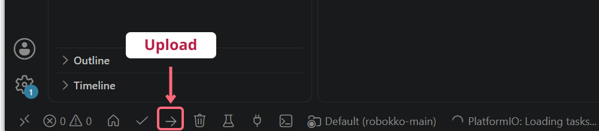

# なかよし！ロボっこキット — ATOM S3R

**かわいいから、つくってみたい。気づいたら、ちゃんとロボットをつくってた。**

画面に顔を出して、サーボモーターで動く手のひらサイズのロボットです。
プログラム・作り方・3D印刷データを公開しています。

## 最初にお読みください

- **3Dプリント部品は高温で変形します。** 高温になる場所に置かないでください。
- **ATOMのディスプレイは、強く押し込むと割れることがあります。** 操作は軽く押してください。
- **サーボに負荷がかかるとATOMが再起動することがあります。** 誤った取り付けや、負荷がかかったまま動かし続けるとサーボが壊れる可能性があります。引っかかったら電源を切って確認してください。

**マカロンちゃんはバッテリー必須（組み立て後のUSB給電は非対応）。おばけねこはUSB・対応バッテリーの両方で使えます。**

## 作り方・必要なもの

| 開くページ | 内容 |
| --- | --- |
| [買い物リスト](docs/shopping-list.md) | 電子部品・道具の通販リンクと店舗案内 |
| [3D印刷データ](docs/printing.md) | キャラクター別の部品・個数・Bambu用設定 |
| [写真つき説明書（PDF）](docs/assembly.md) | マカロンちゃん・おばけねこの組み立て |
| 解説動画：[マカロンちゃん](https://youtu.be/lD4DkPZAsg8) ／ [おばけねこ](https://youtu.be/PJhalL-63JU) | 組み立ての流れを動画で見る |

## はじめに

以下は **VS Code＋PlatformIO IDE拡張** で、ATOM S3Rにプログラムを書き込む手順です。
用意するものは **PC・ATOM S3R・データ通信できるUSBケーブル**（本体側はType-C）。書き込み済みの方は[配線](#servo-wiring)から進めます。
マカロンも、組み立て前の書き込み・動作確認ではATOM単体をUSBで接続します。

## 1. アプリを準備する（初回だけ）

1. [VS Code](https://code.visualstudio.com/)をインストールします。
2. 左端の「拡張機能」で **PlatformIO IDE** を検索し、提供元がPlatformIOのものをインストールします。
3. 準備が終わるまで待ちます。再起動を求められたらVS Codeを再起動します。

画像は導入済みの例です。初めて入れるときは「Install」を押します。

## 2. ダウンロードしてフォルダを開く

1. [GitHubのトップ](https://github.com/hayakawagomichan/robokko)で **Code → Download ZIP** を押します。
2. ZIPを展開します。Windowsは右クリック →「すべて展開」、Macはダブルクリック。
3. フォルダを **英数字だけの場所** に置きます。Windowsの例：`C:\robokko`、Macの例：`/Users/hanako/robokko`。途中に日本語があるとビルドに失敗する場合があります。
4. VS Codeで **ファイル → フォルダーを開く** を選び、`platformio.ini` が直接入っているフォルダを開きます。

`src` はプログラム本体、`include` は顔画像などのデータです。**書き込むだけなら編集不要**です。
フォルダを信頼するか聞かれたら、このGitHubから入手したものと確認して信頼します。初回は道具のダウンロードが終わるまで待ってください。

## 3. 本体をつなぎ、Uploadする

1. **サーボとバッテリーを外し、ATOM S3RだけをUSBでPCにつなぎます。**
2. VS Code左下の **右矢印「→ Upload」** を押します。
3. USBを抜かずに待ち、ターミナルに **SUCCESS** が出たら書き込み完了です。

画像はボタン位置の例です。初回の準備が終わってから押してください。Uploadにはビルドも含まれるので、Buildを別に押す必要はありません。
書き込むと本体の元のプログラムは置き換わります。

## 4. 顔を確認する

USBをつないだまま待つと顔が出ます。本体を横にすると寝顔、縦に戻すと通常の顔になります。
確認できたら **USBを抜いて**、次の配線へ進みます。

## 5. サーボをつなぐ

**配線は電源OFFで行います。** Groveケーブルと4ピン変換コネクタを使い、線の役割を合わせて接続します。

| 役割 | Grove側 | SG90側（今回の実物） |
| --- | --- | --- |
| GND | 黒 | 茶 |
| 5V | 赤 | オレンジ |
| 信号 | 黄・G2 | 黄 |
| 使わない | 白・G1 | 接続しない |

**SG90は製品によって線色が異なります。** 色だけで判断せず、購入品の仕様・端子表示を確認してください。
最初はサーボを機構へ取り付けず、回る部分に物が当たらない状態でUSBをつなぎます。電源を入れるとサーボが動きます。

## 6. 動かしてみる

| 操作 | 動作 |
| --- | --- |
| 画面を1回押す | 往復する／もう1回で元の位置へ戻って止まる |
| 本体を横向きに約2秒保つ | 寝顔になって休止。縦に戻すと往復を再開 |
| 素早く2回押す（ダブルクリック） | **サーボホーンを取り付ける位置へ動き、↑を表示** |
| 本体を軽く振る | 渦巻き顔になる |

ホーンを取り付ける前に、往復を1回押しで止め、**完全に停止してから**ダブルクリックしてください。
[組み立て説明書](docs/assembly.md)へ進みます。次からは電源を入れるだけで遊べます。

## うまくいかないとき

[Uploadボタンがない・書き込めない・サーボが動かない場合はこちら](docs/troubleshooting.md)。

プログラムを編集する方へ

| ファイル | 中身 |
| --- | --- |
| `src/main.cpp` | 顔・ボタン・センサー・サーボの動作 |
| `include/img_*.h` | 顔画像データ |
| `platformio.ini` | ボード設定・使用ライブラリ |
| `build.ps1` | Windows用の書き込み補助 |

PlatformIO espressif32 6.7.0 / Arduino-ESP32 2.0.16。UIFlow2用ではありません。
CLIからの書き込みは `pio run -t upload`。
使用ライブラリ：[M5Unified](https://github.com/m5stack/M5Unified) 0.2.23、[M5GFX](https://github.com/m5stack/M5GFX) 0.2.30、[ESP32Servo](https://github.com/madhephaestus/ESP32Servo) 1.2.1。

## 利用条件・お問い合わせ

個人利用・非商用ワークショップで利用できます。改造データの再配布は非営利に限り、**Forkまたはクレジット表記＋リンク**で利用できます。元リポジトリへの表示が残るForkでは、追加のクレジット表記は不要です。営利販売は禁止、自分で使う部品の印刷代行はOKです。[利用条件の詳細](LICENSE.md)

**ワークショップ・商用利用の相談 → [なかよしロボティクス](https://nakayoshi.tech)**
不具合の報告 → [GitHub Issues](https://github.com/hayakawagomichan/robokko/issues)

企画・制作：なかよしロボティクス ／ 企画・デザイン：ハヤカワ五味 ／ 設計・3Dデータ：uni
